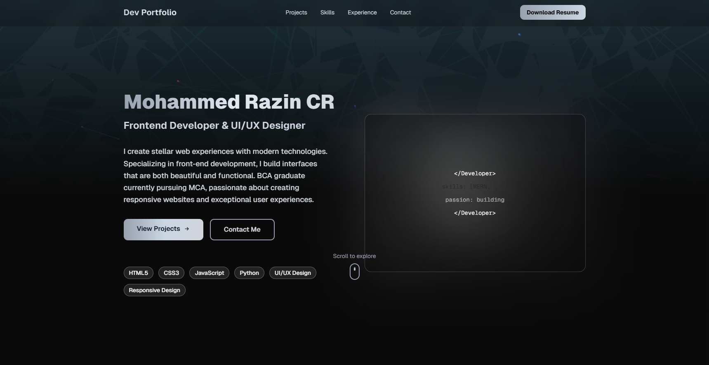

# Mohammed Razin CR - Portfolio Website

A modern, responsive portfolio website showcasing frontend development skills, projects, and professional experience. Built with cutting-edge web technologies and featuring smooth animations, interactive components, and a professional design.

## 🚀 Features

### ✨ Visual Design
- **Modern UI/UX**: Clean, professional design with gray/silver/black color palette
- **Smooth Animations**: 
  - Page loader with canvas-based floating lines animation
  - Typing text animation for personalized greeting
  - Shimmer effects on buttons
  - Gradient backgrounds and text transitions
  - Parallax scrolling effects
- **Fully Responsive**: Mobile-first design that works seamlessly on all devices
  - Mobile (320px+)
  - Tablet (768px+)
  - Desktop (1024px+)
  - Large screens (1280px+)

## 🛠️ Tech Stack

### Framework & Core
- **Next.js 16.0.10** - React framework with Turbopack
- **React 19.2.0** - UI library
- **TypeScript** - Type-safe development

### Styling & UI
- **Tailwind CSS 4.1.18** - Utility-first CSS framework
- **Radix UI** - Accessible component library (50+ components)
- **Lucide React** - Icon library (454+ icons)
- **Tailwind Merge** - Merge Tailwind classes
- **Tailwind Animate CSS** - Animation utilities

### State Management & Utilities
- **React Hook Form** - Form handling
- **Zod** - Schema validation
- **Sonner** - Toast notifications
- **Embla Carousel** - Carousel component
- **Recharts** - Data visualization
- **Next Themes** - Theme switching

### Development Tools
- **pnpm** - Fast package manager
- **TypeScript** - Type checking

### Prerequisites
- Node.js 18+ (or compatible version)
- pnpm (or npm/yarn)

### Installation

```bash
# Clone the repository
git clone <repository-url>
cd Portfolio

# Install dependencies
pnpm install
# or
npm install

# Run development server
pnpm dev
# or
npm run dev
```

Open [http://localhost:3000](http://localhost:3000) in your browser to see the result.

### Build for Production

```bash
# Build the project
pnpm build

# Start production server
pnpm start
```

## 📂 Project Structure

```
Portfolio/
├── app/
│   ├── page.tsx              # Main page with navigation
│   ├── layout.tsx            # Root layout
│   └── globals.css           # Global styles and animations
├── components/
│   ├── hero-section.tsx      # Hero section with typing animation
│   ├── projects-section.tsx  # Projects showcase
│   ├── skills-section.tsx    # Skills with progress bars
│   ├── timeline-section.tsx  # Experience timeline
│   ├── certifications-section.tsx
│   ├── github-section.tsx    # GitHub profile link
│   ├── social-links.tsx      # Contact and social media
│   ├── page-loader.tsx       # Loading animation
│   ├── floating-lines.tsx    # Canvas animation background
│   ├── particle-background.tsx
│   ├── typing-text.tsx       # Typing animation component
│   ├── theme-provider.tsx
│   └── ui/                   # Radix UI components
│       └── [50+ component files]
├── hooks/
│   ├── use-mobile.ts         # Mobile detection hook
│   └── use-toast.ts          # Toast notification hook
├── lib/
│   └── utils.ts              # Utility functions
├── public/                   # Static assets
├── styles/
│   └── globals.css           # Global styles
├── components.json           # shadcn/ui config
├── next.config.mjs           # Next.js configuration
├── tsconfig.json             # TypeScript configuration
├── tailwind.config.ts        # Tailwind CSS configuration
├── postcss.config.mjs        # PostCSS configuration
└── package.json              # Project dependencies
```

## 📞 Contact Information

- **Email**: razincr32@gmail.com
- **GitHub**: [github.com/Mohammed-razin-cr](https://github.com/Mohammed-razin-cr)
- **LinkedIn**: [linkedin.com/in/mohammed-razin-cr](https://www.linkedin.com/in/mohammed-razin-cr-100b432a3/?originalSubdomain=in)
- **Twitter**: [@razincr32](https://x.com/razincr32)

## 📊 Portfolio Highlights

### Technical Skills
- **Frontend**: HTML5, CSS3, JavaScript, React, Next.js
- **Design**: UI/UX Design, Figma, Responsive Design
- **Languages**: JavaScript, Python
- **Tools**: Git, VS Code, Tailwind CSS

### Featured Projects
1. **AI Voice Assistant** - Python, Speech Recognition, NLP
2. **Steganography Project** - Python, Tkinter, Cryptography
3. **Language Detection** - Python, Machine Learning, NLP
4. **College Website** - HTML5, CSS3, JavaScript
5. **Portfolio Website** - JavaScript, CSS3, HTML5
6. **YouTube Content Creator** - Video Editing, Content Creation

### Education & Certifications
- BCA (Bachelor of Computer Applications) - Completed
- MCA (Master of Computer Applications) - In Progress

## 📄 License

This portfolio is open source and available for personal use and modification.

## 🤝 Contributing

Suggestions and improvements are welcome! Feel free to:
- Report bugs
- Suggest new features
- Submit pull requests

## ✨ Future Enhancements

- [ ] Blog section with markdown support
- [ ] Dark/Light theme toggle
- [ ] Multi-language support
- [ ] Contact form with email backend
- [ ] Project filtering by technology
- [ ] Testimonials section
- [ ] Case studies for projects

---

**Built with ❤️ by Mohammed Razin CR**

*Last Updated: January 2026*
